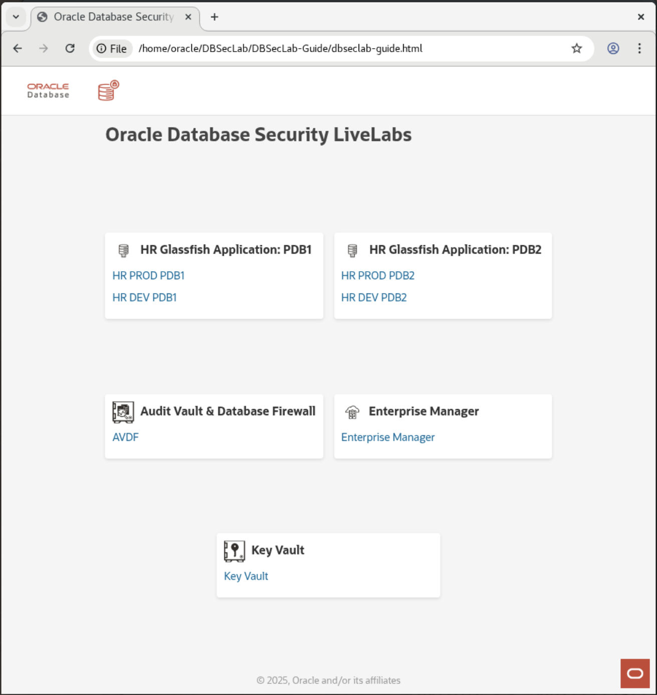
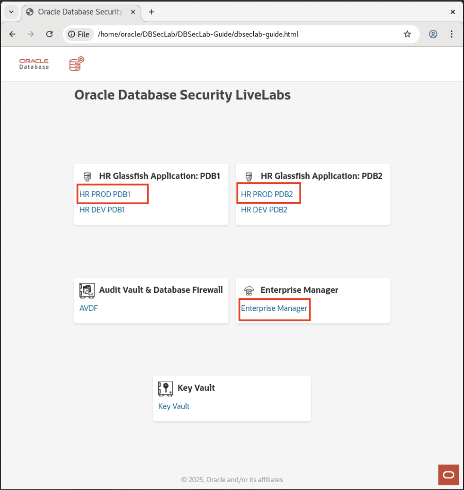
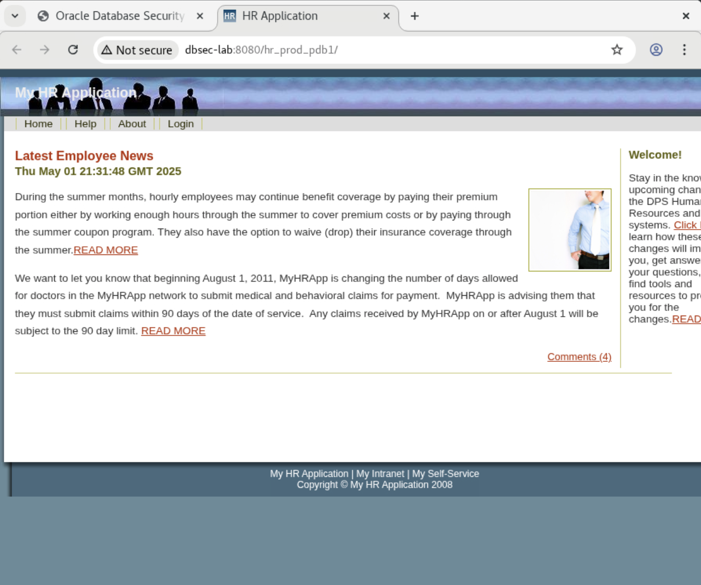
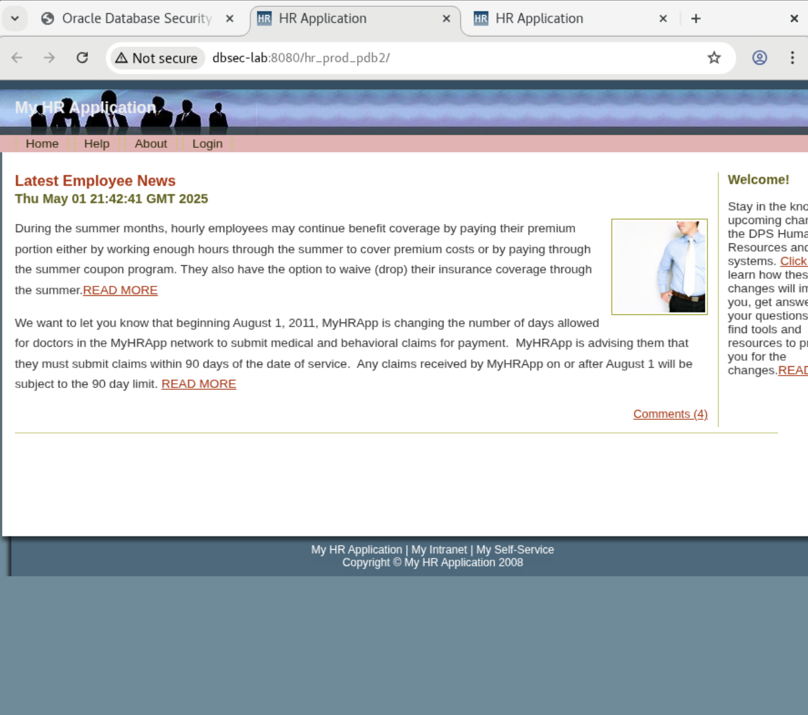
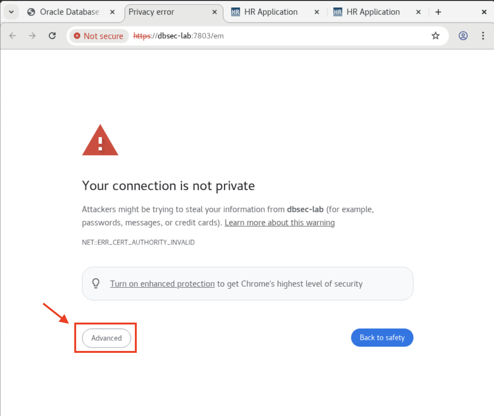
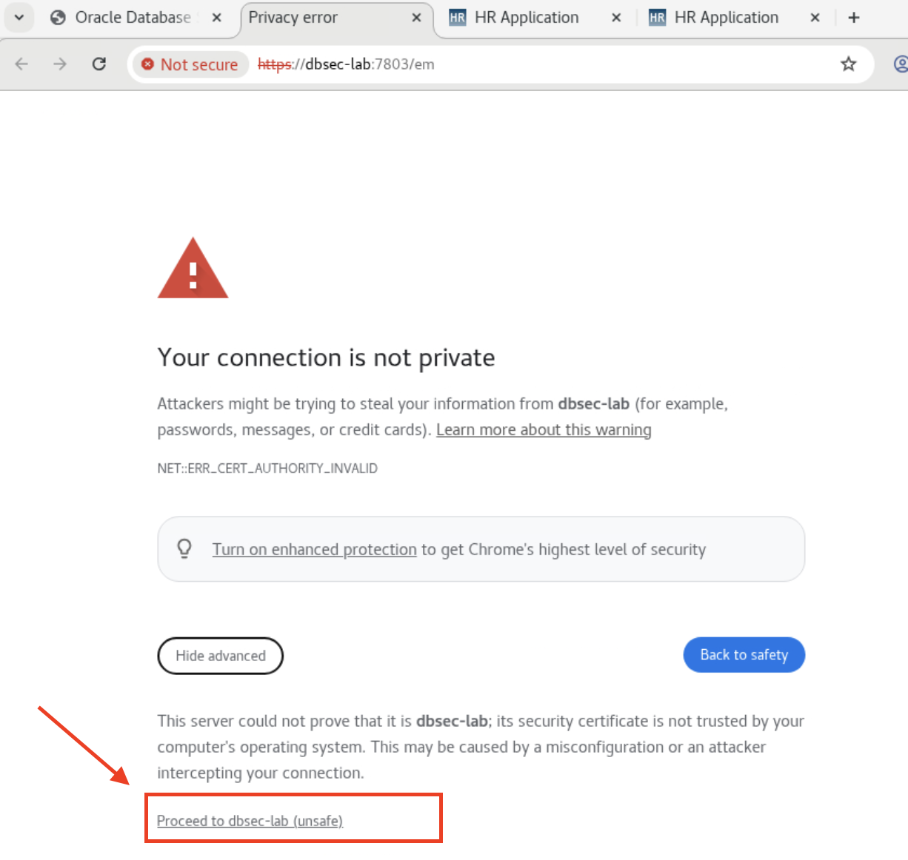
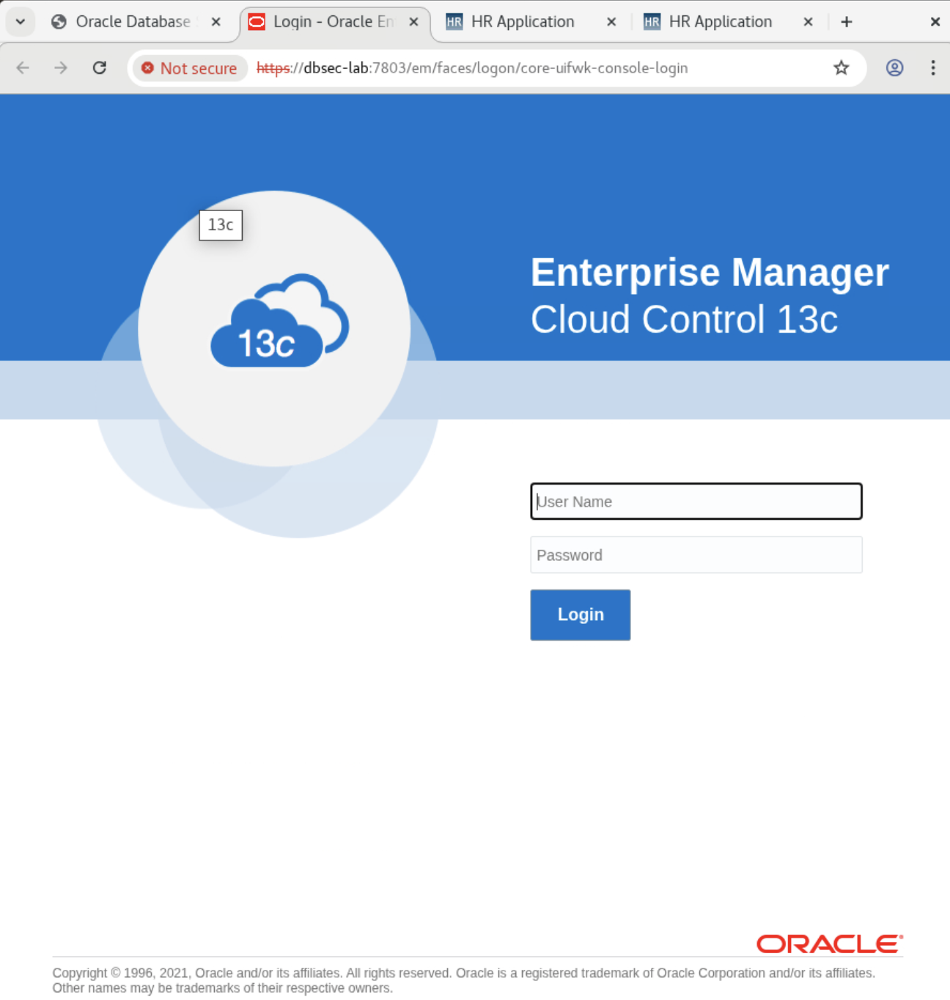
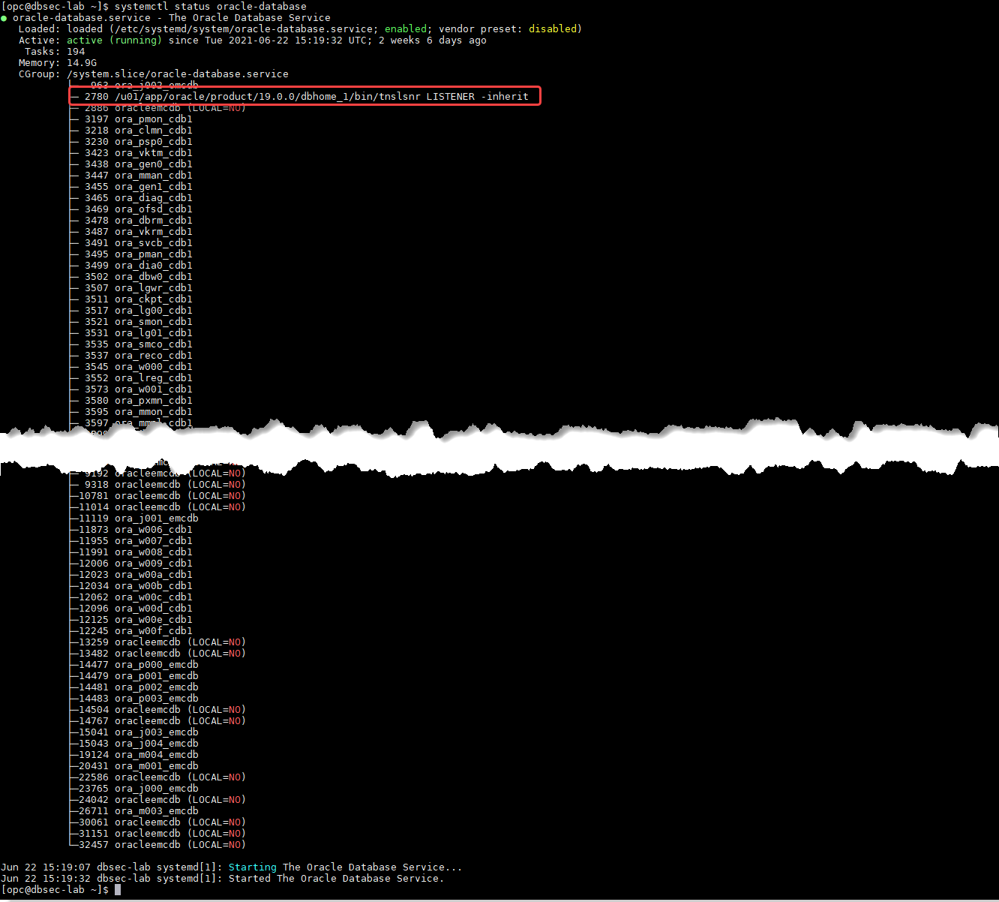

# Initialize Environment

## Introduction

In this lab we will review and startup all components required to successfully run this workshop.

Estimated Time: 10 minutes maximum.

### Objectives
- Initialize the workshop environment.

### Prerequisites
This lab assumes you have:
<if type="brown">
- A Free Tier, Paid or LiveLabs Oracle Cloud account
- You have completed:
    - Lab: Prepare Setup (*Free-tier* and *Paid Tenants* only)
    - Lab: Environment Setup
</if>
<if type="green">
- An Oracle Cloud account
- You have completed:
    - Introduction Tasks
</if>

**Note:** All screenshots for SSH terminal type tasks featured throughout this workshop were captured using the *MobaXterm* SSH Client as described in this step. As a result when executing such tasks from within the graphical remote desktop session, skip steps requiring you to login as user *oracle* using *sudo su - oracle*, the reason being that the remote desktop session is under user *oracle*.

 **Note:**
    - If the login page is not displayed on first login to the remote desktop, refresh to reload.
    - It takes ~15 minutes for all processes to fully start and for NoVNC to load properly.

## Task 1: Validate That Required Processes are up and running

1. Now with access to your remote desktop session, proceed as indicated below to validate your environment before you start executing the subsequent labs. The following Processes should be up and running:

    - Database Listener
    - My HR Applications on Glassfish
    - Enterprise Manager (EM) 13.5

2. On the web browser window on the right is a tab preloaded with our `dbseclab-guide.html` page, where you can quickly access all the relevant pages you need for this lab.

    
    

3. Click on the following URL to make sure that the required HR GlassFish application page is up and running:

    

     

     

    

    

    

4. Validate that the backend services (database and application) are up and running:

    <if type="brown">
    - Open a terminal session with your SSH client on **DBSec-Lab** VM as OS user *oracle*

        ```
        <copy>sudo su - oracle</copy>
        ```

        **Note**:
        - Only **if you are using a remote desktop session**, just double-click on the Terminal icon on the desktop to launch a session directly as oracle.
        - So, in that case **you don't need to execute this command**!
    </if>

    <if type="green">
    - Open a terminal session on **DBSec-Lab** VM as OS user *oracle*

        **Note**: Just double-click on the Terminal icon on the desktop to launch a session directly as oracle!
    </if>

    - Check the Database services status (All databases and Standard Listener)

        ```
        <copy>
        sudo systemctl status oracle-database
        </copy>
        ```

        

    - Check the DBSec-lab Service status (My HR Applications on Glassfish & Enterprise Manager)

        ```
        <copy>
        sudo systemctl status oracle-dbsec-lab
        </copy>
        ```

        

5. If you see questionable output(s), failure or down component(s), restart the corresponding service(s) accordingly

    - Database and Listener

        ```
        <copy>
        sudo systemctl restart oracle-database
        </copy>
        ```

    - DBSec-lab Service

        ```
        <copy>
        sudo systemctl restart oracle-dbsec-lab
        </copy>
        ```

You may now **proceed to the next lab**.

<if type="brown">
## Appendix: External access
If for any reason you want to login from a location that is external to your remote desktop session such as your workstation/laptop, then refer to the details below.

1. My HR Applications on Glassfish

    - PDB1
      - Prod        : `http://<YOUR_DBSECLAB-VM_PUBLIC-IP>:8080/hr_prod_pdb1`
      - Dev         : `http://<YOUR_DBSECLAB-VM_PUBLIC-IP>:8080/hr_dev_pdb1`   (bg: red)
    - PDB2
      - Prod        : `http://<YOUR_DBSECLAB-VM_PUBLIC-IP>:8080/hr_prod_pdb2`  (menu: red)
      - Dev         : `http://<YOUR_DBSECLAB-VM_PUBLIC-IP>:8080/hr_dev_pdb2`   (bg: red & menu: red)
</if>

## Acknowledgements
- **Author** - Ethan Shmargad, Product Manager - May 2025
- **Last Updated By/Date** - Ethan Shmargad, Product Manager - May 2025