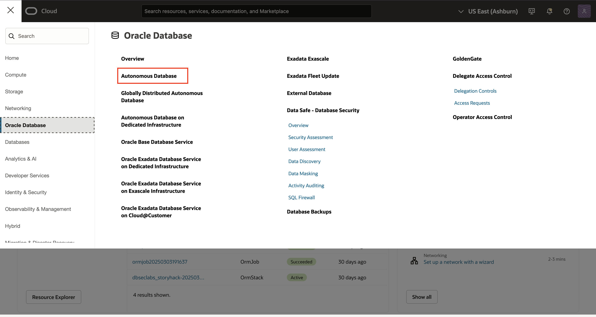
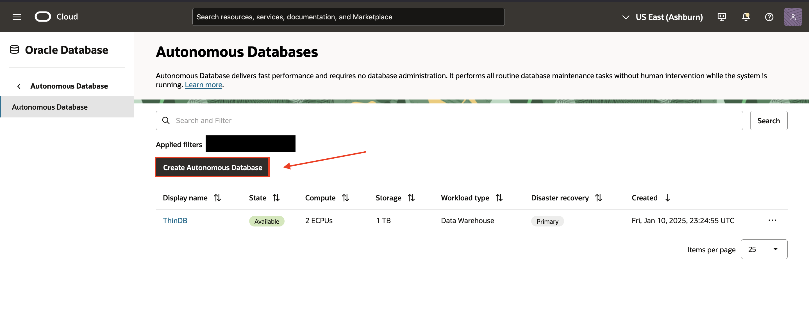
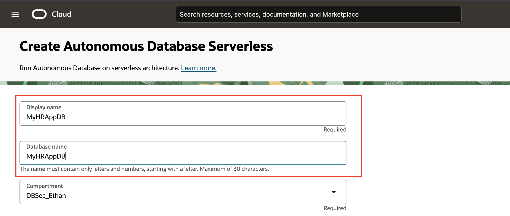
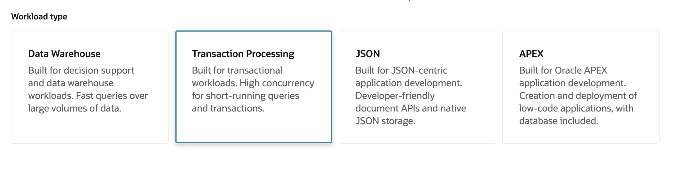
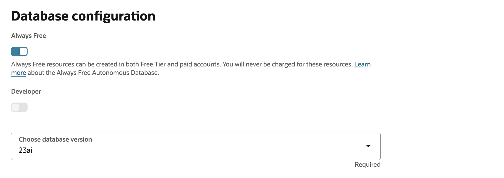
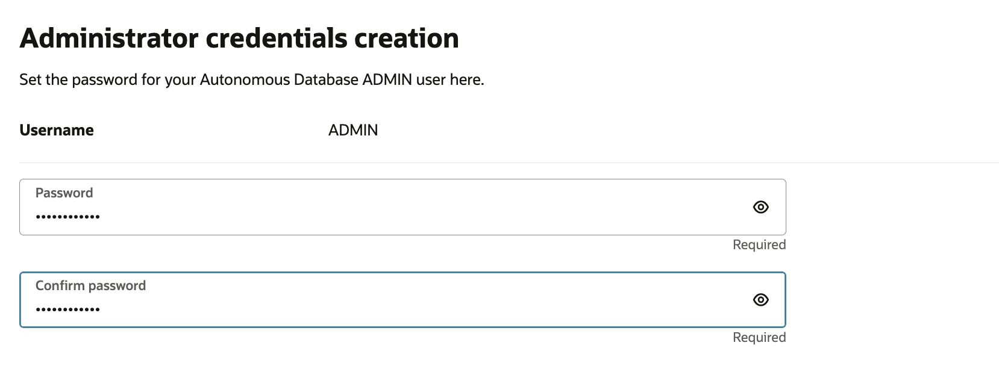
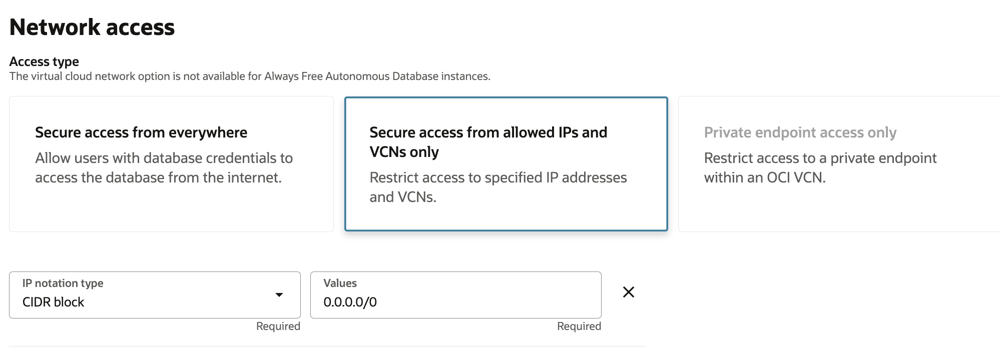
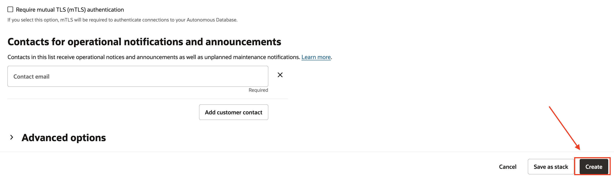
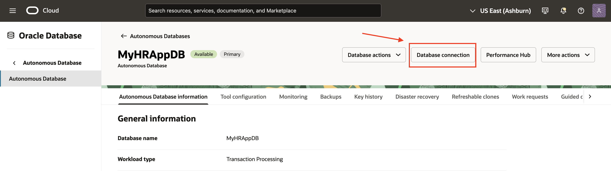
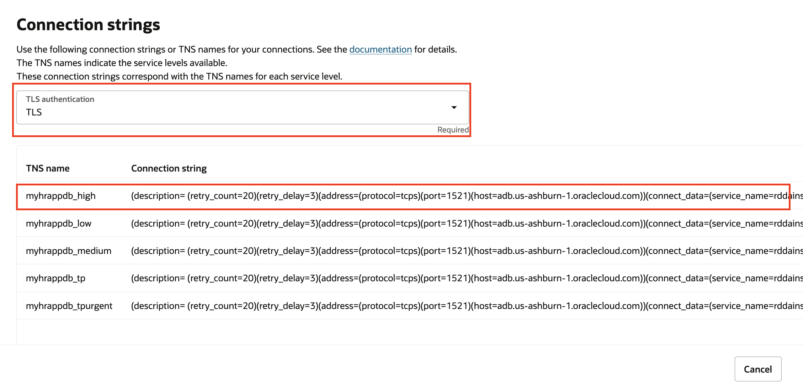

# Configure the Autonomous Database instance

## Introduction

In this lab, we will explore the Oracle Cloud Platform (OCI) and configure the Autonomous Transaction Processing database instance (ATP).

For more information on the Autonomous Transaction Processing database click [here](https://www.oracle.com/autonomous-database/autonomous-transaction-processing/).

### Objectives

In this lab, you will complete the following tasks:

- Create an ATP database instance.

### Prerequisites

This lab assumes you have:
- Oracle Cloud Infrastructure (OCI) tenancy account

## Task 1: Create an ATP database instance.

1. Log into the OCI tenancy. From the opening dashboard, navigate to the ATP portal by selecting the hamburger menu in the top left corner, which will allow for you to select **Oracle Database** and then, **Autonomous Database**

    

2. Making sure the correct compartment is utilized, select **Create Autonomous Database.**

    

3. Use a compartment of your choice and enter a display name and database name of **MyHRAppDB**.  

    

4. For workload type, select **Transaction Processing**.
    
     

5. Under **Database Configuration**, select **Always Free** and choose **23ai** as the database version.

    *Note*: User is not demanded to use **Always Free** and can use any resource configuration of choosing.
    
    

6. Under **Administrator credentials creation**, choose and type in a password for admin credentials to the database.

    

5. Change network access to **allowed IPs and VCNs only** and change IP notation type to **CIDR Block. Input the CIDR value of 0.0.0.0/0 into the blank field.** Make sure that the option for **requiring mutual TLS (mTLS) authentication remains unchecked**.

     

6. Verify all the information is correct. Select **Create** at the bottom.

    

7. Wait a few minutes for the ATP to spin up. When it is ready, it will be indicated with a green tag marked **Available** next to the database name. At the top of the page, select **Database Connection**.

    

8. Scroll down to the **Connection Strings** section of the menu. Under TLS Authentication, make sure **TLS** is selected, not **Mutual TLS**. Then, copy the first connection string to a clipboard of your choice. You will save this string in a particular location in the following steps.

    

You may now **proceed to the next lab.**

## Acknowledgements

- **Author** - Ethan Shmargad, Product Manager
- **Creator** - Richard Evans, Senior Principle Product Manager
- **Last Updated By/Date** - Ethan Shmargad, April 2025