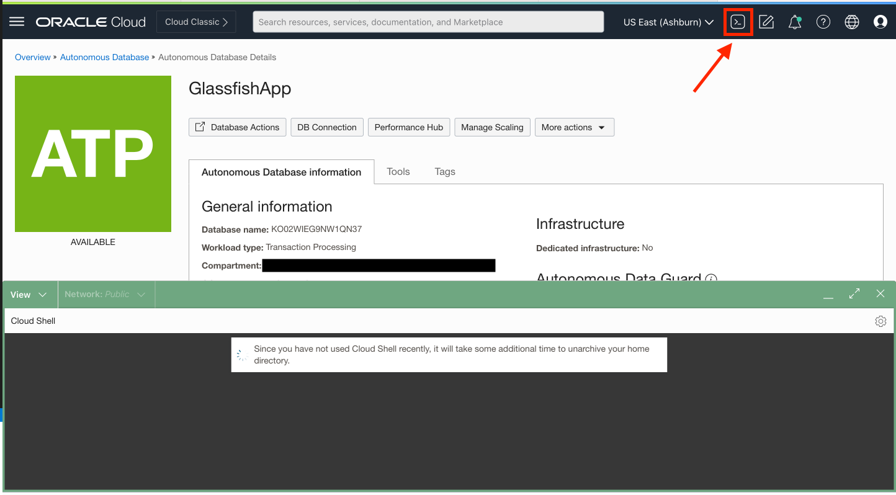
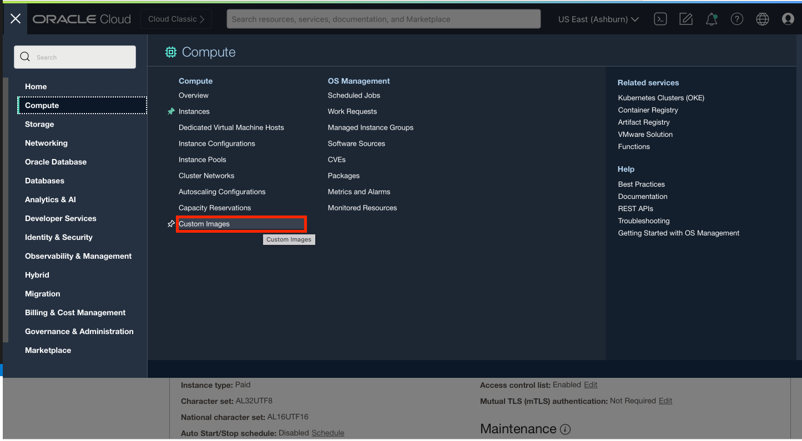
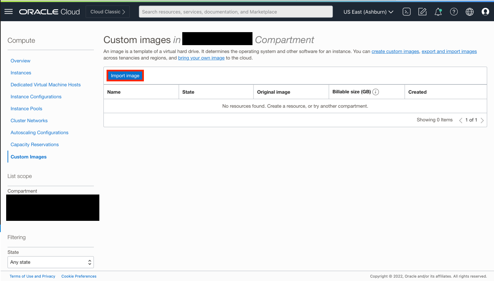
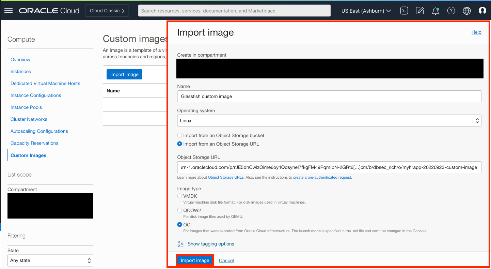
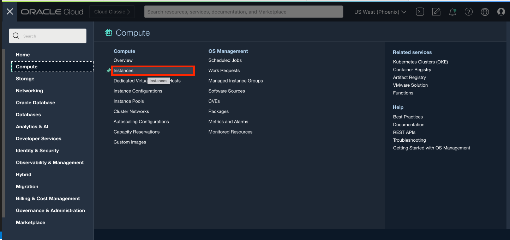
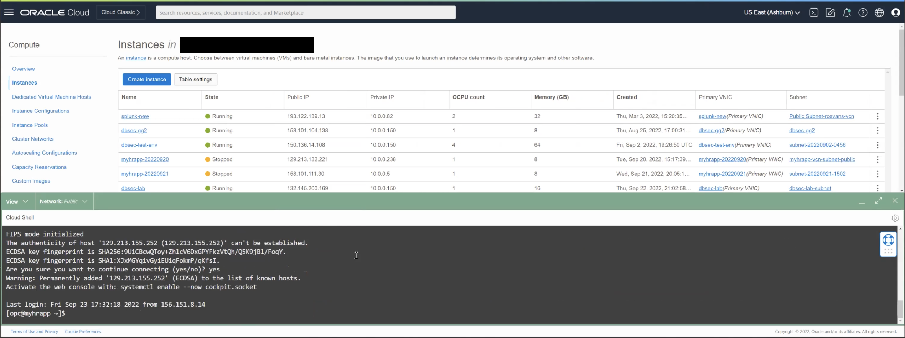
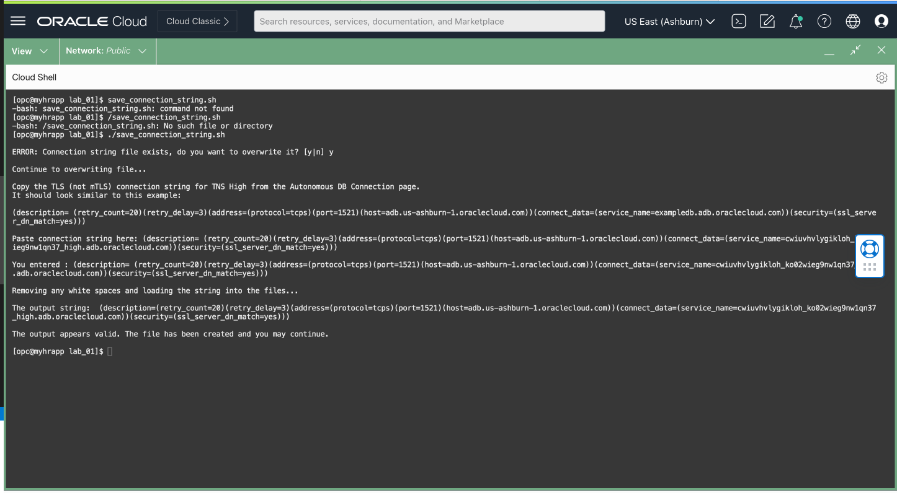

# Connect to the Glassfish legacy HR application

## Introduction

In this lab, we will connect to the Glassfish legacy HR application. This will involve generating an SSH key and using it to connect to the application virtual machine (VM).

### Objectives

In this lab, you will complete the following tasks:

- Setup folders and generate an SSH key-pair.
- Use the SSH to connect to the Glassfish HR application VM.
- Save the ATP TLS connection string in the Glassfish application server's properties file.

### Prerequisites

This lab assumes you have:
- Oracle Cloud Infrastructure (OCI) tenancy account
- Completion of the following previous labs: Configure the Autonomous Database instance

## Task 1: Setup folders and generate an SSH key-pair.

1. Navigate to the top right of your OCI console and select the terminal icon labelled cloud shell and wait for it to load and setup. Cloud Shell is a free-to-use browser-based terminal accessible from the Oracle Cloud Console that provides access to a Linux shell with pre-authenticated Oracle Cloud Infrastructure CLI and other useful developer tools.

    

2. Type in the following commands:

    - Create the application folder:

        ```
        <copy>mkdir myhrapp</copy> 
        ```
    - Go to the created folder:

        ```
        <copy>cd myhrapp</copy>
        ```

    - Set editing preferences:

        ```
        <copy>set -o vi</copy>
        ```
    
    - Generate the SSH key-pair:

        ```
        <copy>ssh-keygen -b 2048 -t rsa -f myhrappkey</copy>
        ```
    - When prompted if you want a passcode, press enter again to avoid creating one.

    - View the key-pair you just created:

        ```
        <copy>ls</copy>
        ```
    - Retrieve the public key and copy/paste it to a clipboard of your choosing. You will need this in future steps:

        ```
        <copy>cat myhrappkey.pub</copy>
        ```

    - Retrieve the private key and copy/paste it to a clipboard of your choosing. You will need this in future steps:

        ```
        <copy>cat myhrappkey</copy>
        ```

3. Minimize cloud shell. You will need it again for future tasks.

## Task 2: Create the Glassfish application instance.

1. Using the hamburger menu at the top left, navigate to **Compute** and select **Custom Images**.

    

2. Select **Import image**.

    

3. Fill in the corresponding fields as shown in the image below (use the compartment of your choice) and select **Import image**. Use the following link for the **Object Storage URL**: https://objectstorage.us-ashburn-1.oraclecloud.com/p/rJE5dhCwlzOime6oy4QdsyneI7fkgFM49PqmIpN-2GRt6[…]cm/b/dbsec_rich/o/myhrapp-20220923-custom-image.

    

4. Once the custom image is available, use the hamburger menu at the top right to navigate to **Compute** and select **Instances**.

    

5. Select **Create instance**.

6. Fill in the corresponding fields with the following information:

    - **Name**: myhrapp
    - **Create in compartment**: Select a compartment of your choice.
    - **Placement**: Select a placement of your choice.
    - **Image**: Select **change image**. Change the image source to **Custom images**. **Make sure your compartment is the same as the one you imported the custom image to**. Select the custom Glassfish image you created in the previous steps (this can sometimes take a little bit of time to load).
    - **Shape**: Use the default shape provided.
    - **Networking**: Select **Create new virtual cloud network** and **Create a new public subnet**. Use a name and compartment of your choice for both. For the CIDR block, use `10.0.0.0/24`. For the public IP address, select **Assign a public IPv4 address**.
    - **Add SSH keys**: Select **Paste public keys**. copy and paste the public ssh key you created from your clipboard (make sure its the public key).
    - **Boot volume**: Make sure all options are **not** checked.

7. Select **Create**.

    

## Task 3: Save the ATP TLS connection string in the Glassfish application server's properties file.

1. Open back up your Cloud Shell terminal. Make sure you are in the `myhrapp` directory.

    ```
    <copy>cd myhrapp</copy>
    ```

2. SSH into the Glassfish application instance using the public IP address of the instance. Whene prompted if you wish to continue the connection, type into the terminal **yes**.

    ```
    <copy>ssh -i myhrappkey opc@<PASTE INSTANCE PUBLIC IP ADDRESS HERE></copy>
    ```

    

3. Move to the `lab_01` directory.

    ```
    <copy>cd lab_01</copy>
    ```

4. Run the `save_connection_string.sh` script to save the TLS connection string from you ATP instance. Paste your connection string when prompted.

    ```
    <copy>./save_connection_string.sh</copy>
    ```
    
    

5. Run the `test_connection_string.sh` script to test the application instance connection to the ATP instance. When prompted, enter your ATP ADMIN password that you created previously.

    ```
    <copy>./test_connection_string.sh</copy>
    ```

    

You may now **proceed to the next lab.**

## Acknowledgements

- **Author** - Ethan Shmargad, North America Specialists Hub
- **Creator** - Richard Evans, Senior Principle Product Manager
- **Last Updated By/Date** - Ethan Shmargad, September 2022