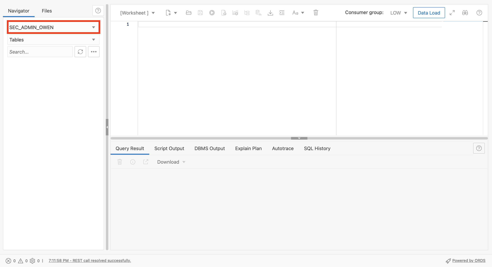
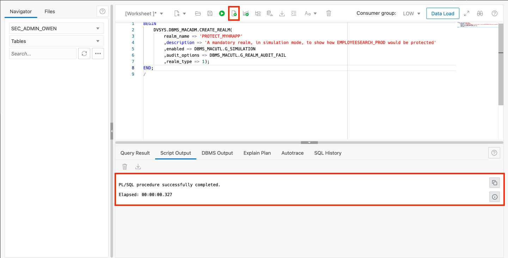
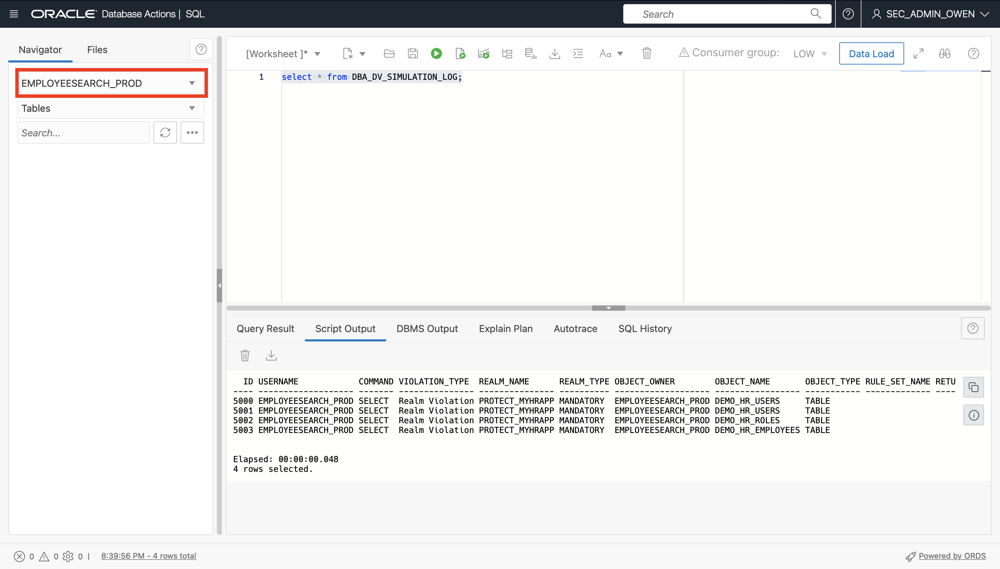
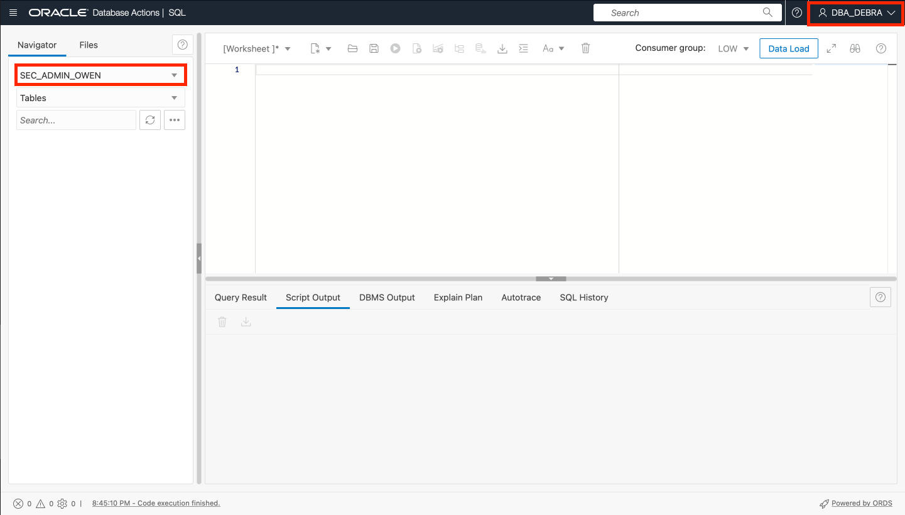
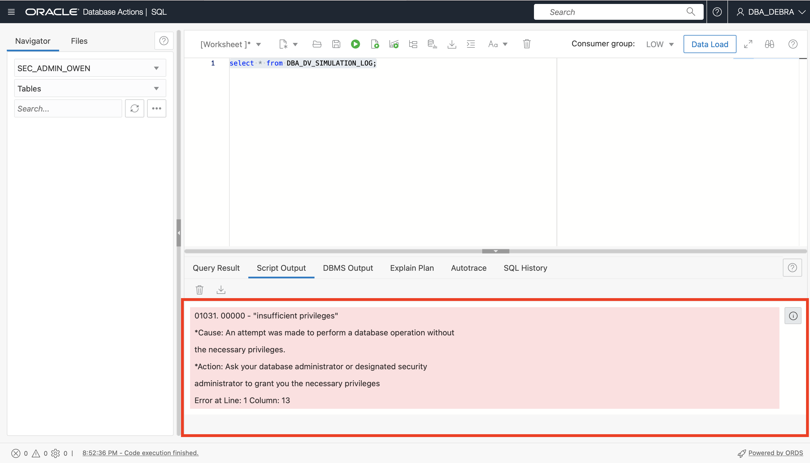

# Identify the connections to the EMPLOYEESEARCH_PROD schema

## Introduction

In this lab, we will explore creating a realm in our ATP instance. We will keep our realm in **simulation mode**. In turn, this will enable us to capture a record of errors during the development phase of a realm or command rule. Using simulation mode, we will then identify our connections to the `EMPLOYEESEARCH_PROD` schema.

### Objectives

In this lab, you will complete the following tasks:

- Create a Database Vault realm.
- Use **simulation mode** to identify the connections to the `EMPLOYEESEARCH_PROD` schema (app versus non-app connections).

### Prerequisites

This lab assumes you have:
- Oracle Cloud Infrastructure (OCI) tenancy account
- Completion of the following previous labs: Configure the Autonomous Database instance, Connect to the Glassfish legacy HR application, Load and verify the data in the Glassfish application, Enable Database Vault and verify the HR application

## Task 1: Create a Database Vault realm

1. Navigate back to your **Database Actions SQL Worksheet**. Under the menu bar for **ADMIN** at the top right select **Sign out**. Sign back into Database Actions under the user `sec_admin_owen` and select **SQL** under **Development**. Make sure the worksheet is clear and your schema is updated from **ADMIN** to `SEC_ADMIN_OWEN`.

	

2. Copy and paste the following script to the SQL worksheet to create a Database Vault realm `PROTECT_MYHRAPP` in order to protect `EMPLOYEESEARCH_PROD`. Select the **Run Script** button to execute the script. Check the script output at the bottom to make sure the script executed successfully.

	```
	<copy>BEGIN
			DVSYS.DBMS_MACADM.CREATE_REALM(
				realm_name => 'PROTECT_MYHRAPP'
				,description => 'A mandatory realm, in simulation mode, to show how EMPLOYEESEARCH_PROD would be protected'
				,enabled => DBMS_MACUTL.G_SIMULATION
				,audit_options => DBMS_MACUTL.G_REALM_AUDIT_FAIL
				,realm_type => 1); 
		END;
		/</copy>
	```

	

3. Clear your SQL worksheet. Copy and paste the following query and check the output to show the current Database Vault Realm was created. 

	```	
	<copy>SELECT name, description, enabled FROM dba_dv_realm WHERE id# >= 5000 ORDER BY 1;</copy>
    ```

	

4. Clear your SQL worksheet. Copy and paste the following script to add the `EMPLOYEESEARCH_PROD` schema, storing all objects to the `PROTECT_MYHRAPP` Database Vault realm. check the output to see that the script executed successfully.

	```
    <copy>BEGIN
       DVSYS.DBMS_MACADM.ADD_OBJECT_TO_REALM(
           realm_name   => 'PROTECT_MYHRAPP',
           object_owner => 'EMPLOYEESEARCH_PROD',
           object_name  => '%',
           object_type  => '%');
    END;
    /</copy>
	```

	```
	PL/SQL procedure successully completed.
	Elapsed: 00:00:00.901
	```
    
In the next task, we are going to capture access to objects in the `EMPLOYEESEARCH_PROD` schema, including access by the schema itself. This will help us understand which objects are available and where they are retrieved from. 

## Task 2: Use simulation mode to identify the connections to the EMPLOYEESEARCH_PROD schema

1. Within the `SEC_ADMIN_OWEN` schema, copy and paste the following query to look at the `dba_dv_simulation_log`. Make sure the output reads that the realm `PROTECT_MYHRAPP` correlates to the object owner `EMPLOYEESEARCH_PROD`

	```
	<copy>select * from dba_dv_simulation_log;</copy>
	```

	

2. Under the **Navigator** menu on the left of the screen, change the schema from `SEC_ADMIN_OWEN` to `EMPLOYEESEARCH_PROD`. Copy and paste the following query to show the Database Vault simulation logs under the `EMPLOYEESEARCH_PROD` schema.

	

	```
	<copy>select * from dba_dv_simulation_log;</copy>
	```

3. Under the menu bar for `SEC_ADMIN_OWEN` at the top right select **Sign out**. Sign back into Database Actions under the user `dba_debra` and select **SQL** under **Development**. Make sure the worksheet is clear and your schema is updated from `DBA_DEBRA` to `SEC_ADMIN_OWEN`.

	

4. Repeat the same query from step two to show that **DBA_DEBRA does not have sufficient priveldges** to access the Database Vault logs.

	```
	<copy>select * from dba_dv_simulation_log;</copy>
	```

	


We have now tested our Database Vault realm in simulation mode and checked that typical DBA users like DBA_DEBRA do not have sufficient priveledges. In the next lab, we will now take our realm from simulation mode to **enforce** mode and explore our application with Database Vault enabled.

You may now **proceed to the next lab.**

## Learn more
- [Configuring Database Vault Realms](https://docs.oracle.com/database/121/DVADM/cfrealms.htm#DVADM003)
- [Oracle Databse Vault Simulation Mode](https://docs.oracle.com/en/database/oracle/oracle-database/12.2/dvadmusing-training-mode-to-log-realm-and-command-rule-activities.html)

## Acknowledgements

- **Author**- Ethan Shmargad, North America Specialists Hub
- **Creator**- Richard Evans, Senior Principle Product Manager
- **Last Updated By/Date** - Ethan Shmargad, September 2022
