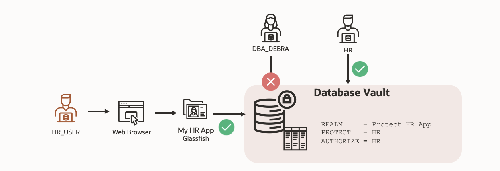

# Securing a legacy application using Oracle Database Vault on Oracle Autonomous Database

## Introduction

Many enterprise applications still rely on legacy app servers and database architectures, making it difficult to enforce modern security controls. In this lab, you’ll migrate a legacy HR application running on GlassFish to **Oracle Autonomous Database (ADB)**—modernizing its data platform while preserving application functionality.

Participants will gain practical experience migrating a legacy application to a modern, cloud-native data platform, while implementing layered security controls that align with today’s robust security requiremens and governance standards. The lab emphasizes real-world techniques for monitoring data access, evaluating potential risks, and enforcing least-privilege policies in a controlled, non-disruptive way.

This lab is designed to showcase how Autonomous Database’s built-in security capabilities, including Database Vault realms and simulation mode, can help you strengthen data security, minimize privileged access risk, and modernize securely—without rewriting your application.

Estimated Time: 90 minutes

### Objectives

In this lab, you will complete the following tasks:

- Connect to the Glassfish legacy HR application
- Configure the Autonomous Database Instance
- Load and verify the data in the Glassfish application
- Enable Database Vault and verify the HR application
- Identify the connections to the EMPLOYEESEARCH_PROD schema
- Explore the Glassfish HR application functions with Database Vault enabled

### Prerequisites

This is a 300-level lab:

- Recommended - Completion of the following workshops:
    - DB Security - Database Vault:  https://livelabs.oracle.com/pls/apex/f?p=133:180:124550529861240::::wid:682
    - Using Oracle Database Vault on Autonomous Database: https://livelabs.oracle.com/pls/apex/f?p=133:180:106941830077530::::wid:3071
- Access to an Oracle Cloud Infrastructure (OCI) tenancy and Cloud Shell
- Familiarity with basic RDBMS concepts is desired
- Basic understanding of cloud and database terms is helpful
- Familiarity with the basics Oracle Cloud Infrastructure (OCI)
- Basic navigation skills around Linux/Bash environments

*Note: Throughout this workshop, if you ever find yourself struggling when it comes to finding your resources in Oracle Cloud, make sure both your compartment and region correspond to where you created the resource.*

## Want to learn more about Oracle Database Vault?
- [Oracle Database Vault Landing Page](https://www.oracle.com/security/database-security/database-vault/)
- [Release 23 Oracle Database Vault Administrator's Guide](https://docs.oracle.com/en/database/oracle/oracle-database/23/dvadm/release-changes.html)
- [Additional Database Vault LiveLab](https://livelabs.oracle.com/pls/apex/r/dbpm/livelabs/view-workshop?wid=682&clear=RR,180&session=100352880546347)

## Acknowledgements

- **Author** - Ethan Shmargad, Product Manager
- **Creator** - Richard Evans, Senior Principle Product Manager
- **Last Updated By/Date** - Ethan Shmargad, April 2025
