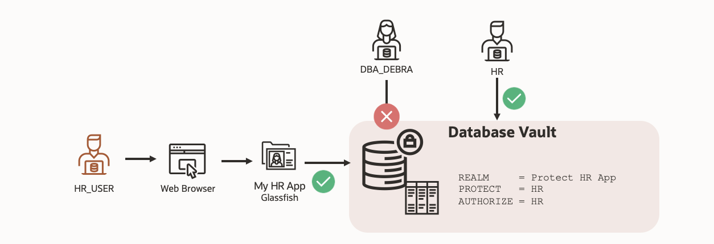

# Securing a legacy application using Oracle Database Vault on Oracle Autonomous Database

## Introduction

One of the primary challenges when moving to the cloud is how to integrate legacy enterprise applications and services into the modern, secure cloud. Oracle Autonomous Database will automatically encrypt data at rest and in motion. By adding Oracle Database Vault, customers can have flexibility and peace of mind to securely move legacy services and applications to the Oracle cloud.

Customers describe three main concerns when moving to the cloud:

- Losing control: When a system goes down, who is to blame?
- Data Protection: When moving to the cloud, how do I make sure my data is secure and encrypted?
- Security: Can other customers access our data? Have all the security patches been kept up to date?
 

Oracle Autonomous Database, with Oracle Database Vault, solves all three concerns. Autonomous Database is a fault-tolerant and highly available solution that automatically encrypts your data at rest and in motion. Oracle Database Vault implements data security controls within Oracle Database to restrict access to application data by privileged users. Reduce the risk of insider and outside threats and address compliance requirements, including separation of duties.

Estimated Time: 90 minutes

### Objectives

In this lab, you will complete the following tasks:

- Connect to the Glassfish legacy HR application
- Configure the Autonomous Database Instance
- Load and verify the data in the Glassfish application
- Enable Database Vault and verify the HR application
- Identify the connections to the EMPLOYEESEARCH_PROD schema
- Explore the Glassfish HR application functions with Database Vault enabled

### Prerequisites

This workshop assumes you have:
- An Oracle Cloud Infratructure tanancy account
- Familiarity with Database is desired
- Some understanding of cloud and database terms is helpful
- Familiarity with Oracle Cloud Infrastructure (OCI) is helpful
- Some basic understanding of data protection and security is a plus
- Some familiarity with Linux/Bash commands is helpful

*Note: Throughout this workshop, if you ever find yourself struggling when it comes to finding your resources in Oracle Cloud, make sure both your compartment and region correspond to where you created the resource.*

## Want to learn more about Oracle Database Vault?
- [Oracle Database Vault Landing Page](https://www.oracle.com/security/database-security/database-vault/)
- [Introduction to Oracle Database Vault](https://docs.oracle.com/database/121/DVADM/dvintro.htm#DVADM001)
- [Additional Database Vault LiveLab](https://apexapps.oracle.com/pls/apex/r/dbpm/livelabs/view-workshop?wid=682&clear=RR,180&session=100352880546347)

## Acknowledgements

- **Author** - Ethan Shmargad, North America Specialists Hub
- **Creator** - Richard Evans, Senior Principle Product Manager
- **Last Updated By/Date** - Ethan Shmargad, September 2022
