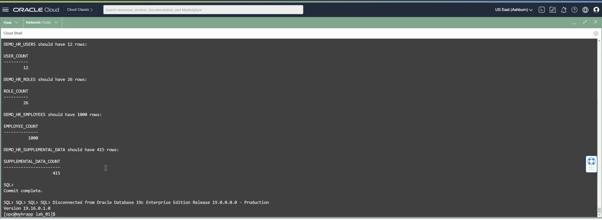
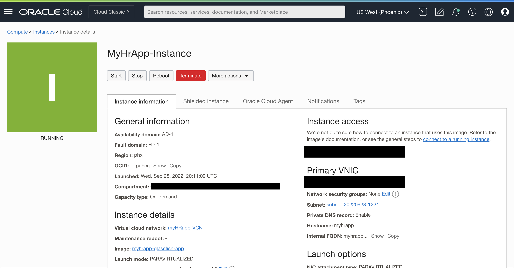
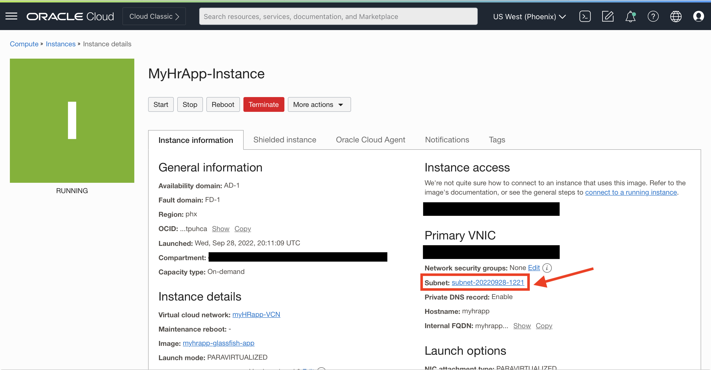
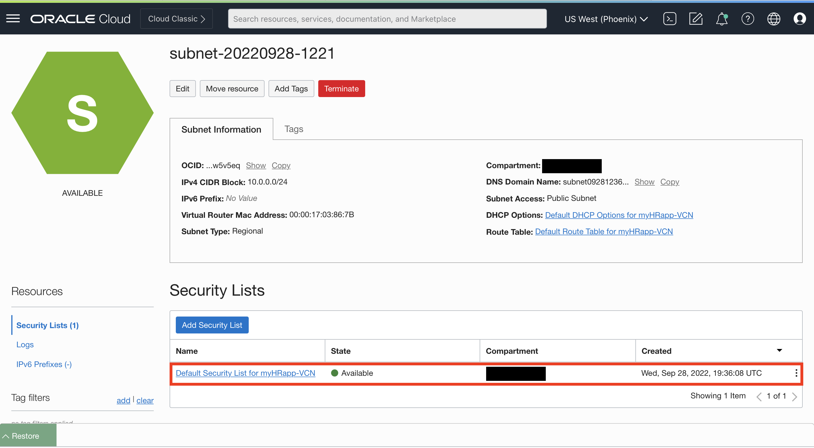
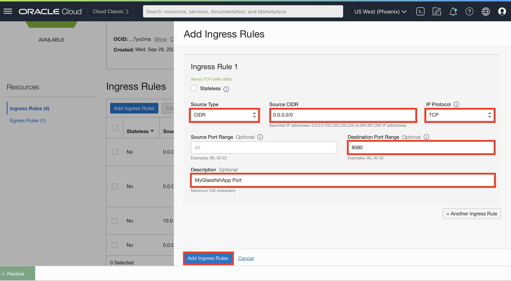
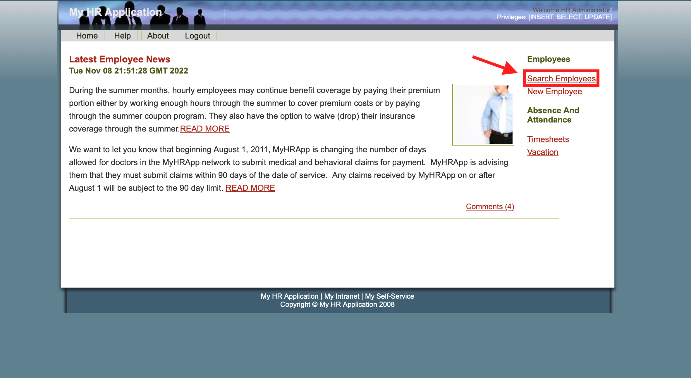

# Load and verify the data in the Glassfish application

## Introduction

In this lab, we will populate the Glassfish application with data and then verify that the HR application still functions appropriately. This will involve loading the `EMPLOYEESEARCH_PROD` schema objects to the ATP instance.

### Objectives

In this lab, you will complete the following tasks:

- Create the `EMPLOYEESEARCH_PROD` schema using `SQL*Plus` from the Glassfish App Server.
- Update the connection string.
- Start the Glassfish application.
- Verify the HR app functions using the Glassfish app **public IP**.

### Prerequisites

This lab assumes you have:
- Oracle Cloud Infrastructure (OCI) tenancy account
- Completion of the following previous labs: Configure the Autonomous Database instance, Connect to the legacy Glassfish HR application

## Task 1: Create the EMPLOYEESEARCH_PROD schema using SQL*Plus from the Glassfish App Server and startup the Glassfish application.

1. Execute the `load_app_data.sh` script to load data into your ATP instance.

    ```
    <copy>./load_app_data.sh</copy>
    ```

    

2. Update the application connection string using the `update_app_connection_string.sh` script.

    ```
    <copy>./update_app_connection_string.sh</copy>
    ```

    

3. Start the Glassfish application using the `startGlassfish.sh` script.

    ```
    <copy>./startGlassfish.sh</copy>
    ```

    

    *Note: If you click the Production or development links, they will not be accessible until after the next step, allowing ingress on port 8080*

## Task 2: Verify the HR app functions using the Glassfish app public IP.

1. Minimize your Cloud Shell terminal and navigate back to you Glassfish app instance in OCI using the hamburger menu under **Compute>Instances**.

    

2. Under the section **Primary VNIC**, select the subnet it created for you.

    

3. Under security lists, select the **default security list** for your subnet.

    

4. Under ingress rules, select **Add Ingress Rules**.

5. Fill in the information according to the image below and select **Add Ingress Rules**.

    

6. Navigate back to your Cloud Shell terminal. Locate the output of the `startGlassfish.sh` script and find both the **Production** and **Development** URLs given to you at the conclusion of the output. You may also copy it from clipboard below. Using two seperate windows on your browser, Make sure to fill both URLs with the instance **public IP**. 

    ```
    <copy>http://<PUBLIC_IP>:8080/myhrapp</copy>
    ```

    ```
    <copy>http://<PUBLIC_IP>:8080/dev_myhrapp</copy>
    ```

    

    

    

**Apply the following steps to both the production and development environments:**

7. Navigate to the menu bar at the top of the page and select **Login**. Use the following login information to sign into the Glassfish application.

    ```
    Username:<copy>hradmin</copy>
    ```

    ```
    Password:<copy>Oracle123</copy>
    ```

8. Once logged in, verify that the data is found in the Glassfish application by navigating to **Search Employees** at the menu bar on the right hand side. Under the search parameters, locate the row **Active** and select **Active** then select **Search** to view the data.

    

    

    

9. Using the menu at the top of the page, select **Home** to navigate back to the home page.

You may now **proceed to the next lab.**

## Acknowledgements

- **Author** - Ethan Shmargad, North America Specialists Hub
- **Contributers** - Richard Evans, Senior Principle Product Manager
- **Last Updated By/Date** - Ethan Shmargad, September 2022
