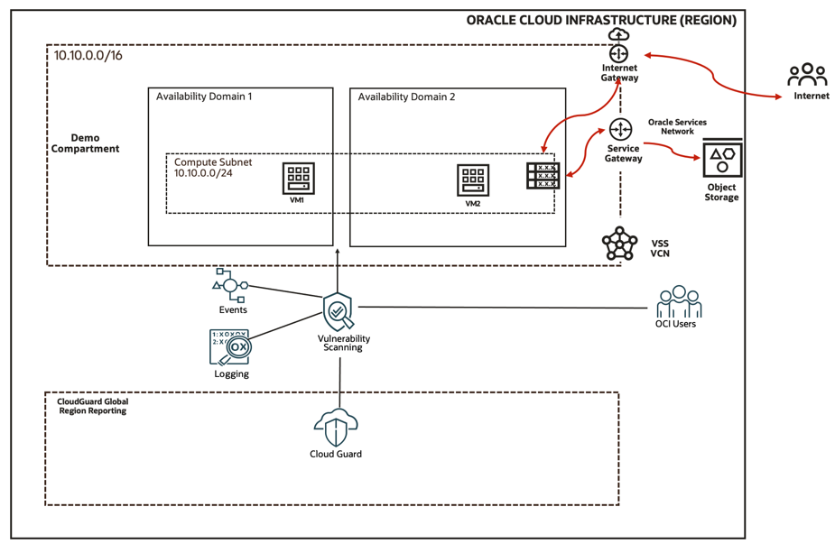
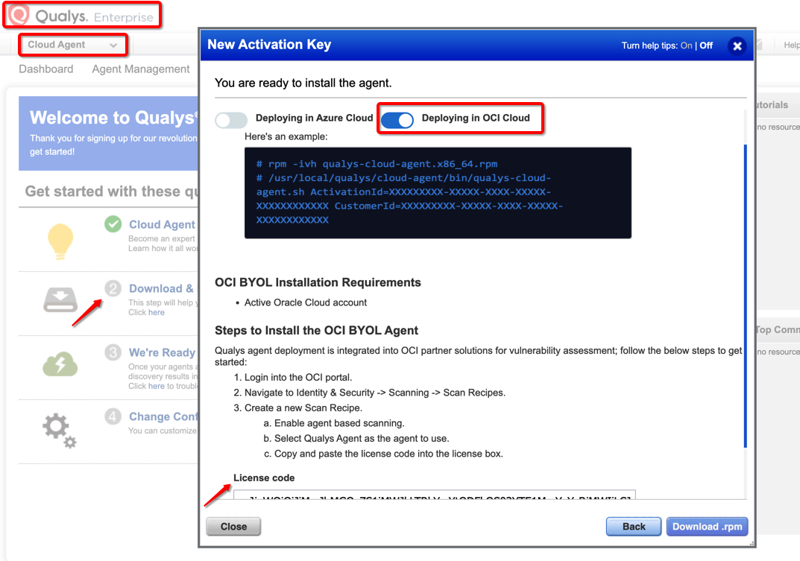

# Introduction to OCI Vulnerability Scanning Service

Oracle Cloud Infrastructure (OCI) Vulnerability Scanning Service (VSS) helps improve your security posture by routinely checking hosts and container images for potential vulnerabilities. The service gives developers, operations, and security administrators comprehensive visibility into misconfigured or vulnerable resources, and generates reports with metrics and details about these vulnerabilities including remediation information. In this workshop you will be using **OCI VSS Service** to scan your workloads. 

This workshop will cover step-by-step(manual) and automated approach which you can follow to deploy required components on Oracle Cloud Infrastructure with **OCI Vulnerability solution integration with Qualys VMDR**.

## Solution

Oracle has partnered with **Qualys** to provide VSS integration solution for customers to leverage their Vulnerability Management, Detection and Response (**VMDR**) license. You can use this solution to scan your workloads running on OCI which provides the following **key benefits**: 

- **Simple** – Change your VSS host scan recipe to use the Qualys agents
- **Managed** – Know that OCI will install and update these agents on your compute instances
- **Vulnerabilities**: Qualys VMDR will match the OCI compute instance information into QIDs (CVEs)
- **Logging/Reporting**: View multi-cloud findings in Qualys dashboard.
- **Finding**: View OCI findings in VSS and Cloud Guard

Attached below is a sample architecture of the solution:

   

Estimated time: 45 minutes

### Objectives

   - Provision the infrastructure using Oracle Resource Manager i.e. Terraform
   - Provision and configure the infrastructure manually 
   - Learn to Deploy OCI Vulnerability Scanning Service integration with Qualys
   - Validate and review Scanning & Vulnerabilities reports from OCI Console
   - Destroy the infrastructure using Oracle Resource Manager or Manually.

### Prerequisites

   - Oracle Cloud Infrastructure paid account credentials (User, Password, Tenant, and Compartment)
   - User must have required permissions, quota to deploy resources.
   - User must have a valid Qualys VMDR Cloud Agent license code. 

   > **Please Read**: You can sign up for [**Qualys VMDR**](https://www.qualys.com/apps/vulnerability-management-detection-response/) and generate a license code with cloud install agent option. 
   
   
   
### Let's get Started!

You may now [proceed to the labs](#next).

### Learn More

1. [OCI Training](https://www.oracle.com/cloud/iaas/training/)
2. [Familiarity with OCI console](https://docs.us-phoenix-1.oraclecloud.com/Content/GSG/Concepts/console.htm)
3. [Overview of OCI Vulnerability Scanning Service](https://docs.oracle.com/en-us/iaas/scanning/home.htm)
4. [OCI Vulnerability Scanning Service Page](https://www.oracle.com/security/cloud-security/cloud-guard/)
5. [OCI CloudGuard Capabilities](https://www.oracle.com/security/cloud-security/cloud-guard/)

## Acknowledgements

- **Author** - Arun Poonia, Principal Solutions Architect
- **Adapted by** - Oracle
- **Contributors** - N/A
- **Last Updated By/Date** - Arun Poonia, Nov 2022